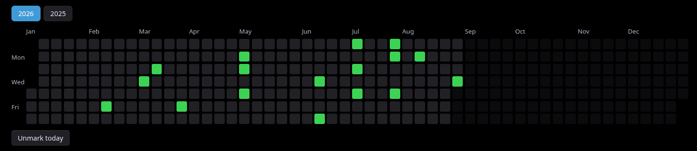
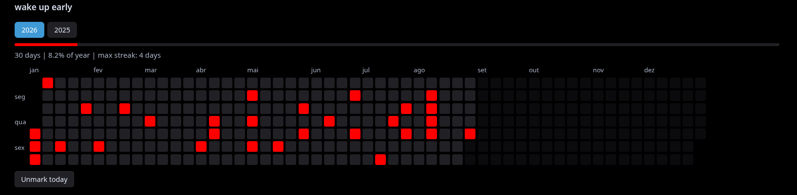

# Streak Heatmap

A simple [Obsidian](https://obsidian.md) plugin that displays a clickable, GitHub-style contribution heatmap — no habit trackers or external dependencies required.




## ✨ Features

- **Click to toggle:** Mark or unmark any past or present day with a single click.
- **"Mark today" button:** Quickly log today's streak without hunting for the right cell.
- **Smart year navigation:** Displays the current year and dynamically adds past years as you log data (up to a 6-year history) to keep the UI clean.
- **Year-bound calendar:** Full January–December grid. Future days are faded out and unclickable (you can't log a streak for a day that hasn't happened yet).
- **Multiple independent boards:** Use the `title:` parameter to create separate heatmaps in the same vault (e.g., "Good Days" and "Workout"). Each title keeps its own independent history.
- **Custom colors:** Use `color:` with a hex value, CSS color name, or Obsidian CSS variable. The default is `#39d353`.
- **Progress statistics:** Use `stats: bar` for a progress bar and summary, or `stats: text` for only the summary. The default is `stats: none`.
- **Native localization:** Month names, weekday labels, and hover dates follow Obsidian's active language.
- **Keyboard accessible:** Navigate between days with `Tab` and toggle them with `Enter` or `Space`.
- **100% local data:** Everything is saved in a `data.json` file inside the plugin folder. Nothing leaves your vault.

## 📦 Installation

### Manual
1. Download `main.js`, `styles.css`, and `manifest.json` from the **Releases** tab of this repository.
2. Create a folder in your vault: `<your-vault>/.obsidian/plugins/streak-heatmap/`.
3. Place the three downloaded files into this folder.
4. In Obsidian, go to **Settings → Community plugins**, refresh the installed plugins list, and enable **Streak Heatmap**.

## 🚀 Usage

Insert a `streak` code block into any note:

    ```streak
    ```

This creates a board with no title, using the default dataset.

To name a board (and keep its marked days separate from other boards in the vault):

    ```streak
    title: Good Days
    ```

Each different `title:` creates and keeps its own history — you can have as many independent boards as you want, one per note, without mixing up the data.

### Colors and statistics

Optional parameters can be combined with `title:`:

    ```streak
    title: Workout
    color: #ff8c42
    stats: bar
    ```

`color:` accepts hex colors, CSS names such as `tomato`, and Obsidian variables such as `var(--color-red)` (the `--color-red` form is also accepted). Invalid values silently use the default green.

`stats: bar` displays a fill bar and the total marked days, the percentage of the selected year, and the longest streak. `stats: text` displays the same information without a visual bar. The percentage uses 365 or 366 days as appropriate, and streaks never cross from one calendar year into another.

## 🛠️ Development

The plugin has no build step — it's plain JavaScript. Edit `main.js` or `styles.css` directly in the plugin folder and reload Obsidian (`Ctrl+R` / `Cmd+R`) to see your changes.

## 📄 License

Distributed under the [MIT License](LICENSE).

---

[](https://claude.com)
