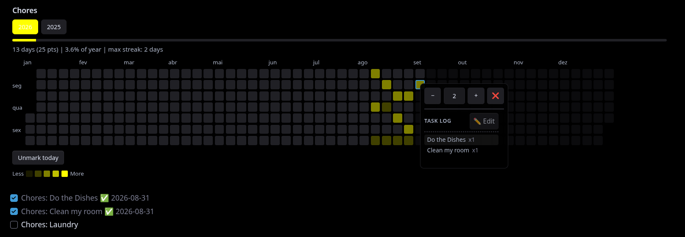

# Streak Heatmap

A local [Obsidian](https://obsidian.md) plugin that displays a clickable, GitHub-style contribution heatmap directly in your notes. Perfect for tracking habits, daily routines, writing streaks, chores, or study goals without external dependencies.


## ✨ Features

- **Click to Track:** Mark any past or present day with a simple click.
- **"Mark today" Button:** Quickly log or unlog today's progress without hunting for the right cell.
- **Independent Boards:** Create as many trackers as you want. Each board keeps its own isolated history.
- **Smart Calendar:** Shows a full January–December grid. Future days are faded out and unclickable. Automatically adds past years to the navigation as you log older data.
- **Full‑Width Mode:** Expand the heatmap to fill the entire width of the note (great for wide dashboards).
- **Accessible & Mobile Friendly:** Fully supports keyboard navigation (`Tab`, `Enter`, `Space`) and touch interactions (including long‑press on mobile).
- **Task Log & Edit (Detailed Mode):** View, edit, and fine‑tune the breakdown of tasks that contributed to each day's points directly inside the popup.

---

## 🚀 Usage

To create a tracker, insert a `streak` code block into any note. A `title` is the only parameter you'll usually want to set:

```streak
title: My Habit
```

No parameters are strictly required — an empty `streak` block also works and creates a single unnamed board — but naming your board keeps its data separate from any other trackers in your vault.

### Additional Parameters

- **`title`** – Names your board and groups its data. Also used for automatic markdown task matching.
- **id** – (Optional) A custom storage key for your data. If omitted, the plugin uses your title to save your history. Use an id if you want multiple boards to share the exact same title, or if you need to rename an existing board without losing its past data.

How to safely rename an older board: First, add id: Your Current Title (matching your old title exactly) to anchor your history. Then, change the title: parameter to your new name. The board will update visually, but continue loading your past points safely from the anchored ID.
- **`mode`** – `simple` (default) or `detailed`.
- **`stats`** – `bar`, `text`, or `none` (default).
- **`color`** – Custom highlight color (supports Hex, RGB, CSS names, and theme variables).
- **`width`** – Set to `full` to stretch the heatmap across the entire width of the note.

Example:

```streak
title: Study
mode: detailed
stats: bar
color: #ff4757
width: full
id: my-study-board
```

---

## ⚙️ Display Modes

The plugin operates in two distinct modes depending on how you want to track your data.

### 1. Simple Mode (Default)

If you don't specify a mode, the board defaults to `simple`. Ideal for basic "done/not done" habit tracking.

- **Interaction:** Click an empty day to mark it (it turns colored). Click it again to unmark it.

```streak
title: Drink Water
mode: simple
```

### 2. Detailed Mode

Designed for tracking specific numerical values (like pages read, miles run, or hours studied). The cell's color intensity will scale across **5 levels** depending on how many points you log.

```streak
title: Pages Read
mode: detailed
```

**How to use Detailed Mode:**

- **Quick Add:** Click (or press `Enter`/`Space`) on a day to instantly add **+1 point**.
- **Point Editor:** Open the precise popup editor to set an exact number, subtract points, or clear the day entirely.
  - *Desktop:* **Right‑click** the cell (or press `Shift+F10`).
  - *Mobile:* **Long‑press** the cell.

#### Task Log & Edit Feature

Inside the points popup, you can view the breakdown of tasks completed on that specific day.



- Click the **✏️ Edit** button to modify individual task counts, add missing items, or fine‑tune your logs interactively.
- If a logged task starts with the board's title (e.g. `Chores: Do the dishes`), that prefix is hidden in the list — you'll just see `Do the dishes`. The full name (title included) is still what's stored internally, so it keeps matching back to the right line in your note.
- Each board tracks up to **30 distinct task names per day**. Anything beyond that is grouped under a single "Other tasks" entry, so your log stays readable even on unusually busy days.

#### Automated Markdown Task Syncing (Detailed Mode Only)

If you have an unchecked markdown task in the *same note* that contains the board's title, completing it will automatically add **+1 point** to today's streak. The plugin appends a date badge to prevent double‑counting.

- **Before:** `- [ ] Pages Read: chapter 4`
- **After clicking the checkbox:** `- [x] Pages Read: chapter 4 ✅ 2026-08-29`

Unchecking the task again removes the badge, so it becomes completable once more. The point already logged for that day is kept — unchecking just resets the task, it doesn't undo your streak.

---

## 🎨 Customizing Colors & Stats

You can personalize the look of your heatmap using the `color` and `stats` parameters.

### Colors

Use the `color:` parameter to change the heatmap's highlight color. The plugin understands almost any standard color format. If you provide an invalid color, it safely falls back to the default green.

**Examples of accepted color formats:**

- **Hex Codes:** `color: #ff8c42` or `color: #39d353`
- **CSS Names:** `color: tomato` or `color: dodgerblue`
- **RGB Values:** `color: rgb(57, 211, 83)` or simply `color: 57, 211, 83`
- **Obsidian Theme Variables:** `color: var(--interactive-accent)` or simply `color: --interactive-accent` (great if you want the heatmap to change colors automatically when you switch Obsidian themes).

### Statistics

Use the `stats:` parameter to show your progress below the calendar.

- `stats: bar` – Displays a visual progress bar, total marked days, percentage of the year, and your longest streak.
- `stats: text` – Displays the same summary text, but without the visual progress bar.
- `stats: none` – (Default) Hides the statistics entirely.

*Note: The percentage is always calculated out of the full calendar year (365 or 366 days). In detailed mode, any day with 1 or more points counts as exactly "1 marked day" for your streak and percentage.*

---

## 🔧 Under the Hood (Technical Details)

- **100% Local Storage:** Your history is saved entirely offline inside a `data.json` file in the plugin's folder. Data is completely private and migrates automatically if you previously used version 1.1 or 1.2.x.
- **Native Localization:** The plugin automatically reads your active Obsidian language settings. Month names, weekday labels, and date formats will dynamically translate to your native language without any manual configuration. It also respects the locale's first day of the week.
- **Security:** Board titles and markdown contents are sanitized using Obsidian's secure DOM API to prevent XSS vulnerabilities.
- **Performance:** To handle large vaults and frequent clicks smoothly, the plugin caches file reads (with a bounded size), debounces disk writes (300ms), and uses a `ResizeObserver` to redraw only when necessary.
- **Reliable Task Sync:** File processing uses a state machine (`idle`, `processing`, `queued`) to avoid race conditions when multiple modifications occur in quick succession.
- ***Note on Downgrading:** If you ever revert to version 1.2.2 or older, your numeric daily points will be fully preserved, but your detailed task breakdown (the task log) will be permanently cleared by the older version's data validation.*

---

## 📦 Installation

This plugin is available in the Obsidian community plugins browser and can be downloaded and installed directly from there.

### Manual Installation

1. Download `main.js`, `styles.css`, and `manifest.json` from the **Releases** tab.
2. Create a folder in your vault at: `<your-vault>/.obsidian/plugins/streak-heatmap/`
3. Place the three downloaded files into this folder.
4. In Obsidian, go to **Settings → Community plugins**, refresh the installed plugins list, and enable **Streak Heatmap**.

## Acknowledgments

Thanks to [@FilipeSix](https://github.com/FilipeSix) for contributing to this release.

## 📄 License

Distributed under the [MIT License](LICENSE).

---

[](https://claude.com)
[](https://gemini.google.com)